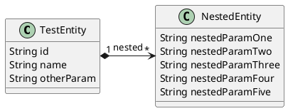

```plantuml

@startuml
class TestEntity {
  String id
  String name
  String otherParam
}

class NestedEntity {
    String nestedParamOne
    String nestedParamTwo
    String nestedParamThree
    String nestedParamFour
    String nestedParamFive
}

TestEntity "1" *-right-> "*" NestedEntity: nested
@enduml
```